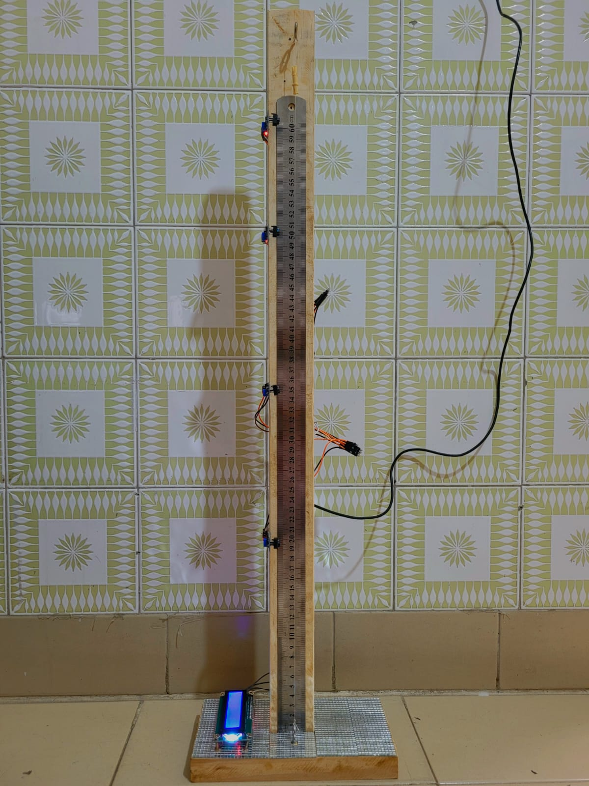

<h1 align="center">Velocidade Instântanea 📏</h1>

Projeto realizado em C++ com o intuito de descobrirmos a velocidade instântanea de um objeto em queda livre.

  <a href="#-tecnologias">Tecnologia</a>&nbsp;&nbsp;&nbsp;|&nbsp;&nbsp;&nbsp;
  <a href="#-projeto">Projeto</a>&nbsp;&nbsp;&nbsp;|&nbsp;&nbsp;&nbsp;
  <a href="#-materiais">Materiais</a>

## 🚀 Tecnologias
Desenvolvido através dessas tecnologias:
- C++
- Arduino

## 💻 Projeto

  

## 📐 Materiais
- ESP32
- Jumper
- Sensor óptico TCRT 5000
- Régua Inox de 60cm
- Madeira

<h5>Desenvolvido por <b>Cléo Leal</b> e <b>Ana Julia Oliveira</b> para o CheckPoint da FIAP.</h5>